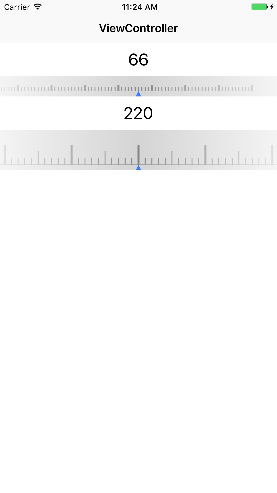

# ZYYRulerView

A easy way to create a ruler view.

## Installation

### Manually

Drag the ZYYRulerView/ZYYRulerView/ZYYRulerView folder into your project.

## Examples

### Ruler with block

```
- (ZYYRulerView *)rulerOne {
    if (!_rulerOne) {
        _rulerOne = [[ZYYRulerView alloc] initWithFrame:CGRectMake(0, CGRectGetMaxY(self.labelOne.frame), CGRectGetWidth(self.view.frame), 30)];
        _rulerOne.backgroundColor = [UIColor colorWithWhite:0.667 alpha:0.500];
        [_rulerOne updateCurrentValue:10];
        self.labelOne.text = [NSString stringWithFormat:@"%@", @(10)];
        [_rulerOne rulerViewCurrentValueWithBlock:^(NSNumber *value) {
            NSLog(@"rulerOne value = %@", value);
            self.labelOne.text = [NSString stringWithFormat:@"%@", value];
        }];
    }
    return _rulerOne;
}
```

### Ruler with delegate

```
- (ZYYRulerView *)rulerTwo {
    if (!_rulerTwo) {
        _rulerTwo = [[ZYYRulerView alloc] initWithFrame:CGRectMake(0, CGRectGetMaxY(self.labelTwo.frame), CGRectGetWidth(self.view.frame), 60)];
        _rulerTwo.backgroundColor = [UIColor colorWithWhite:0.667 alpha:0.500];
        _rulerTwo.rulerMinValue = 100;
        _rulerTwo.rulerMaxValue = 500;
        _rulerTwo.rulerSpacing = 10;
        _rulerTwo.rulerShortLineLength = 10;
        _rulerTwo.rulerMiddleLineLength = 20;
        _rulerTwo.rulerLongLineLength = 30;
        _rulerTwo.isShowHorizonalLine = YES;
        _rulerTwo.delegate = self;
        [_rulerTwo updateCurrentValue:200];
        self.labelTwo.text = [NSString stringWithFormat:@"%@", @(200)];
    }
    return _rulerTwo;
}
```

```
- (void)zyy_rulerViewCurrentValue:(NSNumber *)value {
    NSLog(@"rulerTwo value = %@", value);
    self.labelTwo.text = [NSString stringWithFormat:@"%@", value];
}
```

## Screenshots

<p align="center">

</p>


